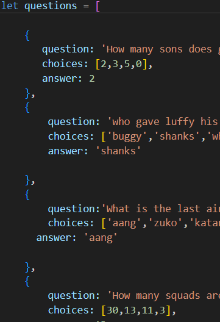
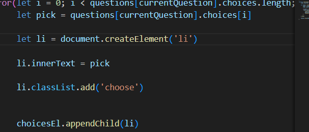
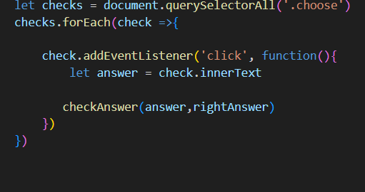
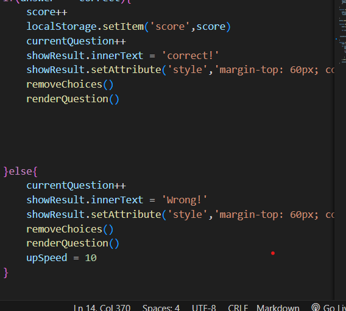
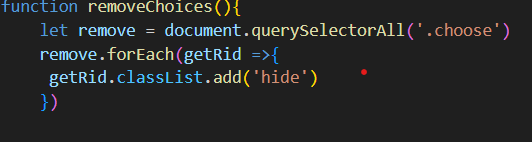
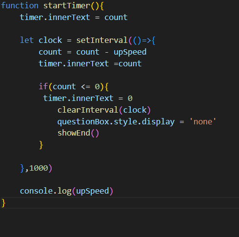
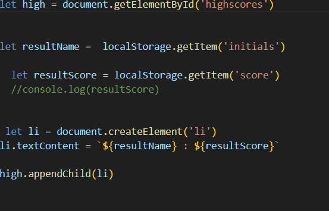

# code-quiz

## Description

In this task i created my own coding quiz by 
1. creating an event listener that would listen for a click and start a function called startUp, that would clear the welcome screen and would launch the timer function and the question maker function called renderQuestion.
2. Then inside renderQuestion function i created an array that stored objects, the choices and the answer, the question

3. Then i used a for loop to create my choices by accessing the the choices values creating li's using create element and storing it in my choicesEl

4. i added an event listener that would chech if the user had picked the right answer to the question 

5. the checkAnswer function would check if the answer was correct using an if statement if true it would increse the score , save the score in the localStorage i created  add +1
to my currentQuestion variable which helps switch between questions using the index show that it can be picked from the object. it also removed the previous choices by adding a display none to it classlist and would the activate renderQuestions to get a new set of Questions. if returned false it wouldchange my up speedvariable to 10 to minus it from the current timer

6. if the user complete or ran out of time the questions and choices would both be hidden and an end screen would showup where the user could see there score and enter their initials that was stored in local storage.

7. code for timer 

i used setInterval to create the timer

8. To show inital and score on screen
